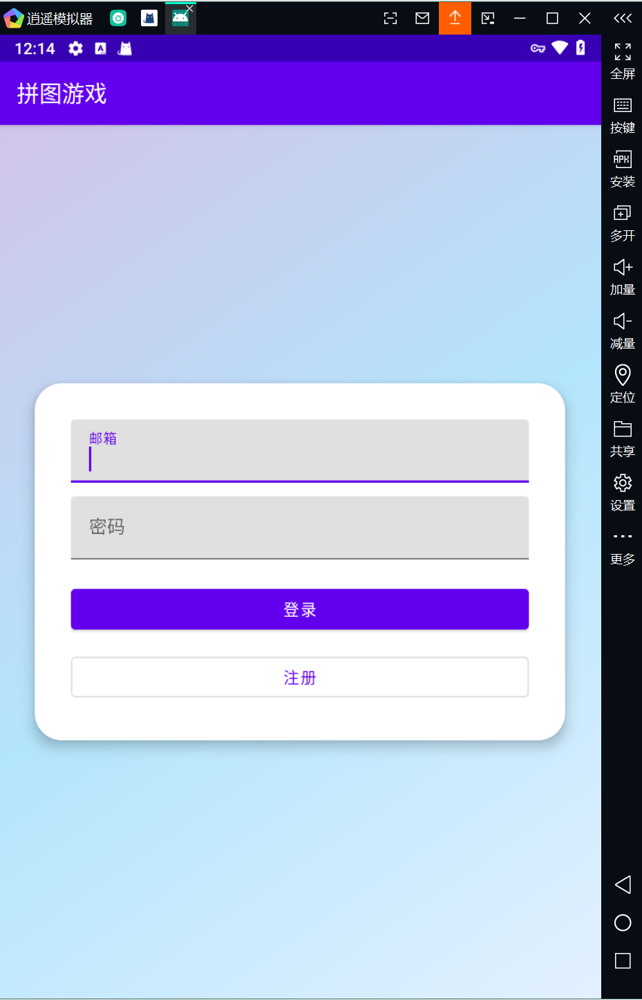
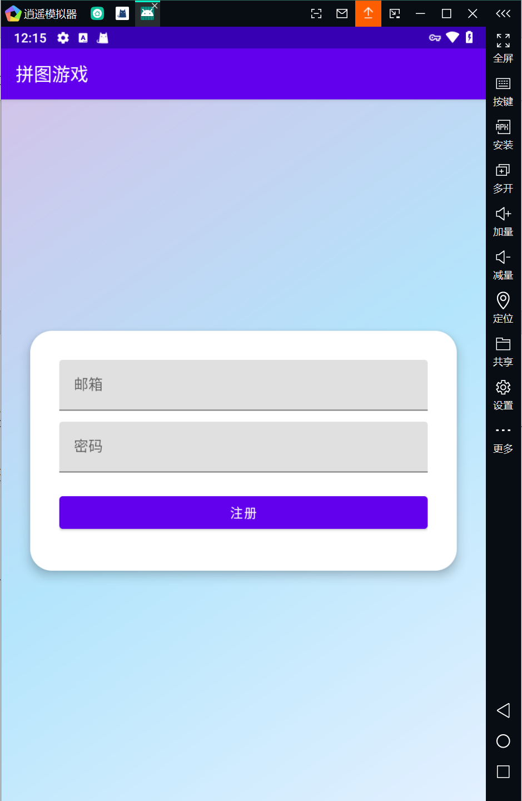
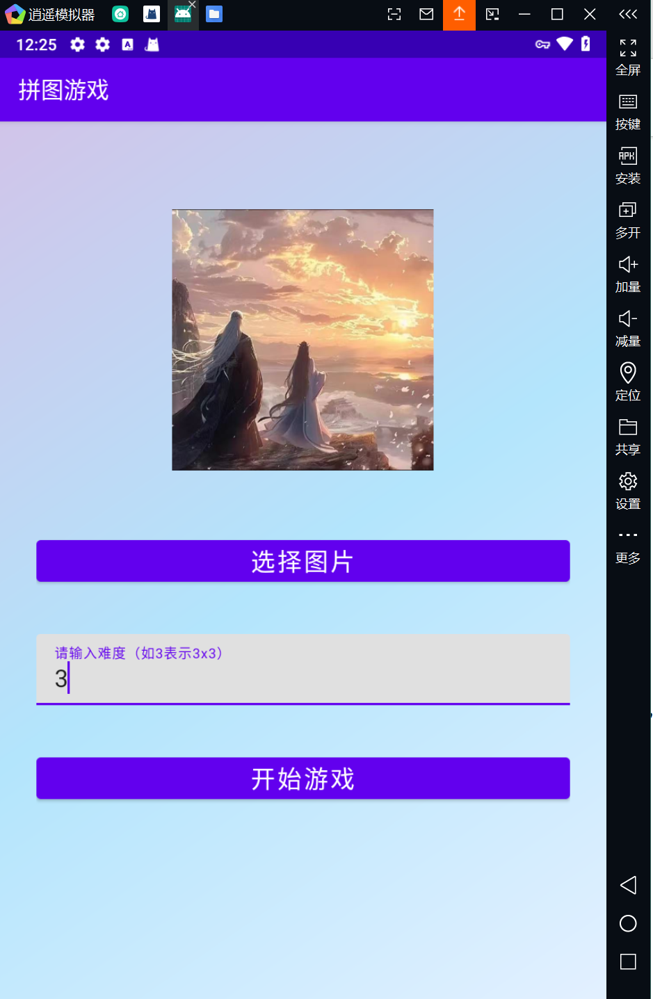
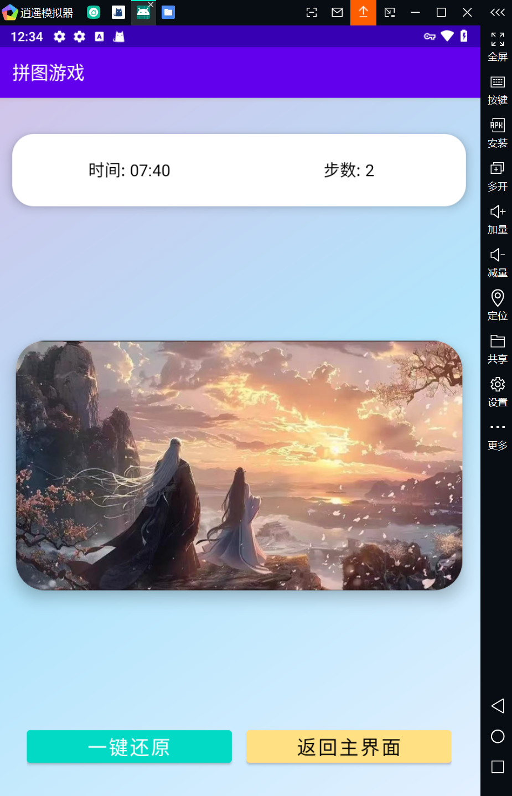
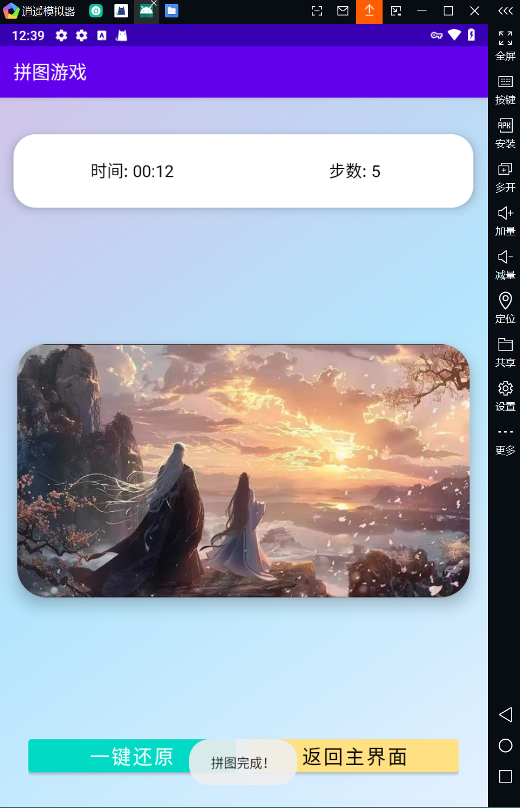
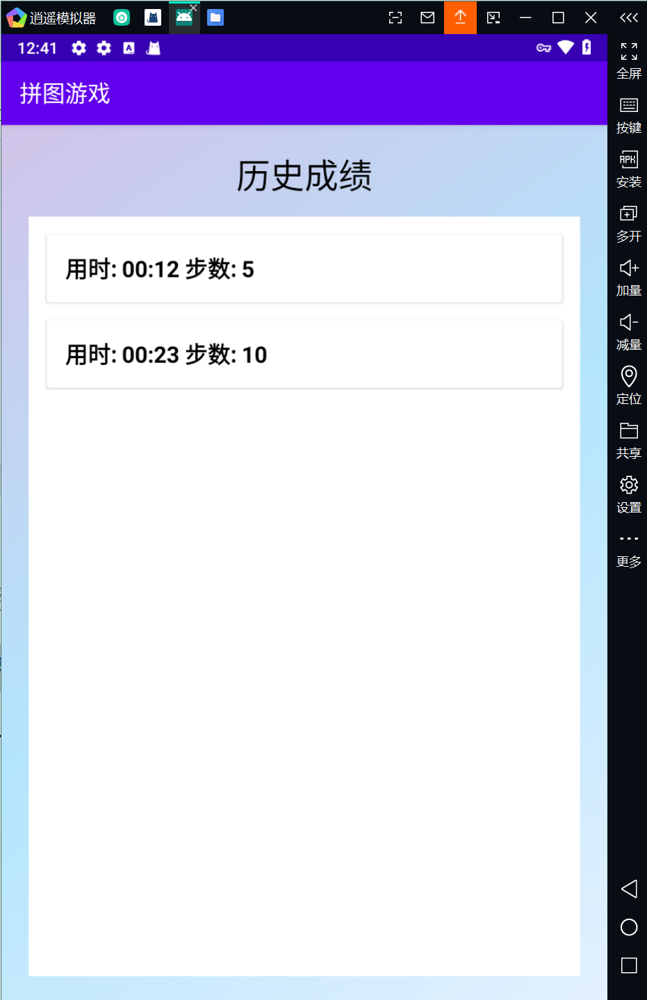
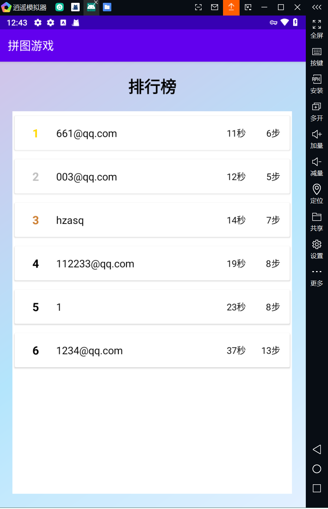
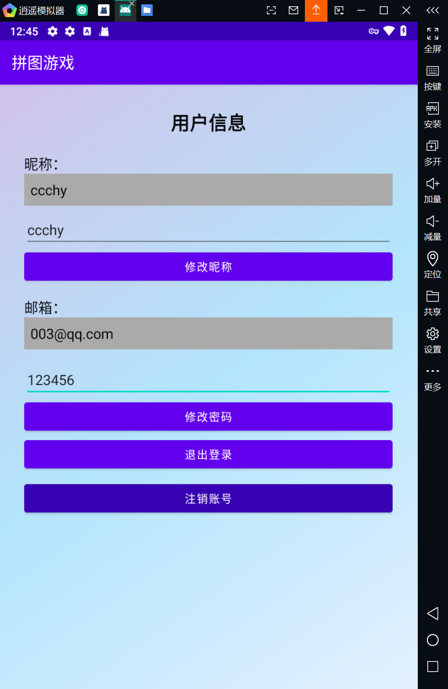

# PuzzleGame-Android（拼图游戏）

一个基于 Android 的交换式拼图小游戏。支持从本地选择任意图片，按 n×n 网格切片，通过点击两块进行交换完成拼图。内置计时与步数统计，并提供历史成绩、云端排行榜与用户中心。

---

## 功能特性

- 图片与难度
  - 选择任意图片；难度范围 2–10，对应 n×n 切片。
- 游戏交互
  - 点击一次选中、再次点击另一块进行交换；选中块高亮。
  - 实时计时与步数统计；按住“还原”按钮可临时预览原图。
- 成绩与排行
  - 完成后自动保存成绩：本地历史（按用户区分）与云端最佳（时间/步数）。
  - 排行榜：从 Firestore 查询 Top 20（按最佳时间升序）。
- 用户中心
  - 登录/注册（邮箱+密码，Firebase Auth）。
  - 修改昵称、修改密码、登出、注销账号。
- 主界面入口
  - 开始游戏 / 历史成绩 / 用户信息 / 排行榜。

---

## 技术栈与版本

- 语言/平台
  - Kotlin 1.8.0，Android（minSdk 24，target/compileSdk 34）
  - JDK 17
- 构建
  - Gradle Wrapper 8.5（`gradle/wrapper/gradle-wrapper.properties`）
  - Android Gradle Plugin 8.1.0
- UI
  - Material Components、ConstraintLayout、GridLayout
- 架构
  - ViewModel + LiveData + 协程（`viewModelScope`）
- 数据与服务
  - 本地：SharedPreferences（历史成绩按 UID 命名空间隔离）
  - 云端：Firebase Auth、Cloud Firestore（使用 BOM 32.7.1）

---

## 目录结构

```
.
├─ app
│  ├─ src/main/java/com/puzzle/game
│  │  ├─ core/ChyPuzzleGame.kt           # 核心拼图逻辑（切片顺序、交换、完成判定）
│  │  ├─ viewmodel/ChyGameViewModel.kt   # 游戏状态、计时、成绩持久化
│  │  ├─ ui/                             # 各页面 Activity/Adapter
│  │  │  ├─ ChyGameActivity.kt           # 游戏界面
│  │  │  ├─ ChyGameSettingActivity.kt    # 游戏设置（选图/难度）
│  │  │  ├─ ChyMainActivity.kt           # 主页入口
│  │  │  ├─ ChyHistoryActivity.kt        # 历史成绩
│  │  │  ├─ ChyRankActivity.kt           # 排行榜
│  │  │  ├─ ChyUserInfoActivity.kt       # 用户中心
│  │  │  ├─ ChyHistoryAdapter.kt
│  │  │  └─ ChyRankAdapter.kt
│  │  └─ model/                          # 轻量数据模型
│  ├─ src/main/res/layout                # 布局资源
│  ├─ src/main/res/values                # 颜色/字符串/主题
│  └─ src/main/AndroidManifest.xml       # 清单与入口
├─ build.gradle.kts                      # 顶层构建脚本
├─ settings.gradle.kts                   # 模块与仓库配置
└─ app/build.gradle.kts                  # 应用模块依赖
```

---

## 快速开始

### 1) 开发环境
- Android Studio（Giraffe 或更高版本）
- JDK 17（Android Studio 自带或本地安装均可）
- 推荐真机或 Android 11+ 模拟器测试

### 2) Firebase 配置（可选但推荐）
- 在 Firebase Console 创建项目并添加 Android 应用，包名默认为 `com.puzzle.game`。
- 下载 `google-services.json` 放到 `app/google-services.json` 覆盖现有文件。
- 开启 Cloud Firestore，并为开发环境设置合适的安全规则（生产环境请收紧权限）。

> 不使用 Firebase：可以删除相关依赖与代码分支，或仅在无网络/演示场景下使用离线登录。

### 3) 构建与运行
- Android Studio 直接点击 Run 运行到设备；或使用命令：

```
# Windows
./gradlew.bat assembleDebug

# macOS/Linux
./gradlew assembleDebug
```

---

## 使用指南

1. 启动应用，进入登录页：
   - 在线：使用邮箱+密码登录或注册（注册后自动回填邮箱）。
   - 离线：无网络时可使用内置离线账号 `test / 123456` 体验本地功能。
2. 主页选择“开始游戏”：
   - 在游戏设置页选择图片（系统文档选择器）与难度（2–10）。
3. 游戏中：
   - 点击任意块选中，再点击另一块交换；选中块会高亮。
   - 顶部实时显示“用时/步数”；按住“还原”按钮可预览原图。
4. 完成后：
   - 自动保存本局到本地历史；若已登录，会尝试更新云端最佳成绩（时间/步数）。
5. 其他：
   - 历史：查看本地成绩列表；排行榜：查看云端 Top 20；用户中心：修改昵称/密码、登出、注销。

---

## 数据与隐私

- 本地：
  - `SharedPreferences` 以 `history_scores_<uid>` 存储历史成绩（未登录为 `guest`）。
- 云端（可选）：
  - `users` 集合：`uid`、`username`、`email`、`rankTime`（秒）、`rankMoves`（步数）。
- 注意：
  - 示例配置仅用于演示，请在生产环境完善 Firestore 安全与认证策略。

---

## 已知问题与改进建议

- 初始洗牌逻辑可更严谨：
  - `ChyPuzzleGame.shufflePieces()` 建议在洗牌循环中调用完成性检测，确保初始状态不是完成态。
- 注册邮箱校验逻辑需修正：
  - `ChyRegisterActivity` 中的正则判断存在条件反转，应改为“不匹配才提示错误”。
- 资源与依赖可精简：
  - 未使用的依赖：Room（含 kapt）、RxAndroid、Firebase Analytics；
  - 未启用使用的 ViewBinding/DataBinding 可关闭；
  - 少量未使用 drawable/字体资源可清理；
  - ViewModel 中个别未用方法/字段可删除，`moves` 可从 `gameState` 直接读取以减少状态重复。

---

## 贡献与开发

- 代码风格：Kotlin 官方风格（`kotlin.code.style=official`）。
- 目标 JDK：17，Gradle 使用 Wrapper。
- 提交 PR 前请自测基本流程（登录/设置/拼图/成绩/排行/用户中心）。

---

## 许可

当前未设置 LICENSE，可按需要添加许可证文件。

---

## 致谢

- Material Components for Android
- Firebase（Auth / Cloud Firestore）

 > 如果你在使用或二次开发过程中遇到问题，欢迎在 Issue 中反馈。

---

## 界面截图 / 示意图

以下为建议的截图清单与引用方式。请将你的截图放在 `docs/screenshots/` 目录下，并按建议命名，README 会自动引用。

- 文件组织（建议）
  - docs/screenshots/login.png（登录）
  - docs/screenshots/register.png（注册）
  - docs/screenshots/home.png（主页）
  - docs/screenshots/game_settings.png（游戏设置）
  - docs/screenshots/game_play.png（游戏进行中）
  - docs/screenshots/game_preview.png（按住还原预览）
  - docs/screenshots/game_completed.png（完成弹窗/完成状态）
  - docs/screenshots/history.png（历史成绩）
  - docs/screenshots/leaderboard.png（排行榜）
  - docs/screenshots/user_info.png（用户中心）

- Markdown 快速引用

```


```

- 三列网格排版（可选，GitHub 支持 HTML）

<table>
  <tr>
    <td><br/>登录</td>
    <td><br/>注册</td>
    <td><br/>主页</td>
  </tr>
  <tr>
    <td><br/>游戏设置</td>
    <td><br/>游戏进行中</td>
    <td><br/>原图预览</td>
  </tr>
  <tr>
    <td><br/>完成状态</td>
    <td><br/>历史成绩</td>
    <td><br/>排行榜</td>
  </tr>
  <tr>
    <td><br/>用户中心</td>
    <td></td><td></td>
  </tr>
</table>


